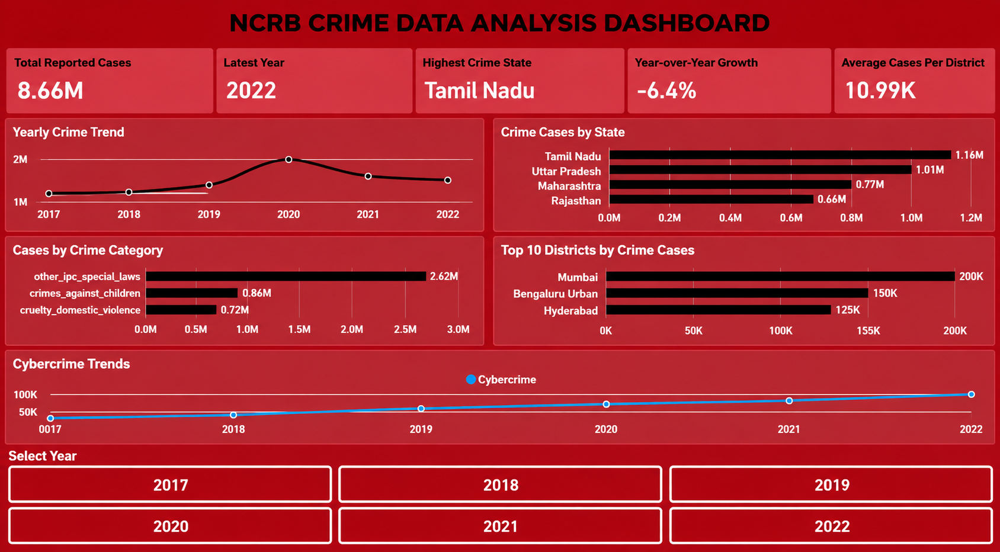

\# NCRB Crime Data Analysis

\## 📌 Project Overview

This project analyzes crime data across India to identify trends, patterns, state-level differences, district-level variations, and changes in crime categories over time.

The project follows a complete data analytics workflow using \*\*Excel, Python, SQL, Power BI, and DAX\*\*, transforming raw crime data into meaningful insights through data cleaning, analysis, and interactive visualization.

\---

\## 🎯 Objectives

\- Analyze crime trends from 2017 to 2022

\- Identify states with higher reported crime cases

\- Analyze crime patterns across districts

\- Compare different crime categories

\- Analyze year-over-year changes in reported cases

\- Study cybercrime trends

\- Build an interactive Power BI dashboard

\- Demonstrate an end-to-end data analytics workflow

\---

\## 🛠️ Tools \& Technologies

\- \*\*Excel\*\* – Initial data inspection and preparation

\- \*\*Python\*\* – Data cleaning and preprocessing

\- \*\*Pandas\*\* – Data manipulation and analysis

\- \*\*SQL\*\* – Data validation, transformation, and analytical queries

\- \*\*Power BI\*\* – Interactive dashboard development

\- \*\*DAX\*\* – Measures and KPI calculations

\- \*\*Jupyter Notebook\*\* – Python-based data analysis

\- \*\*Git \& GitHub\*\* – Version control and project documentation

\---

\## 📊 Dataset

The dataset contains crime records covering the period \*\*2017–2022\*\*.

\### Dataset Dimensions

\- Approximately \*\*5,920 records\*\*

\- \*\*31 columns\*\*

\- State-level and district-level information

\- Multiple crime categories

\### Key Dimensions

\- Year

\- State

\- State Code

\- District

\- District Code

\- Registration Circles

\- Crime Category

\### Major Crime Categories

The dataset includes categories related to:

\- Murder / Homicide

\- Rape / Sexual Violence

\- Kidnapping / Abduction

\- Crimes Against Children

\- Domestic Violence

\- Dowry Crimes

\- Cybercrime

\- Cyber Fraud

\- Theft / Property Crimes

\- Cheating / Fraud

\- Forgery / Counterfeiting

\- Human Trafficking

\- Juvenile Crimes

\- Other IPC and Special Law Crimes

\---

\## 🔄 Project Workflow

Raw Dataset

&#x20;   ↓

Excel Data Inspection

&#x20;   ↓

Python \& Pandas

&#x20;   ↓

Data Cleaning \& Validation

&#x20;   ↓

SQL Analysis

&#x20;   ↓

Data Transformation

&#x20;   ↓

Power BI

&#x20;   ↓

DAX Measures \& KPIs

&#x20;   ↓

Interactive Dashboard

&#x20;   ↓

Insights \& Reporting

